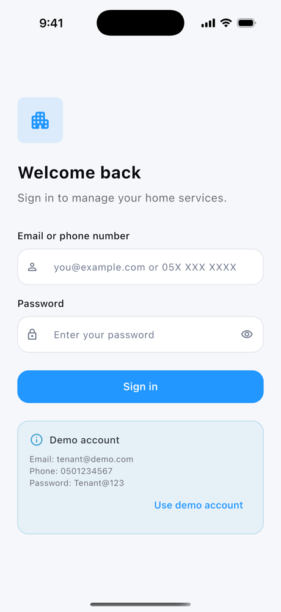
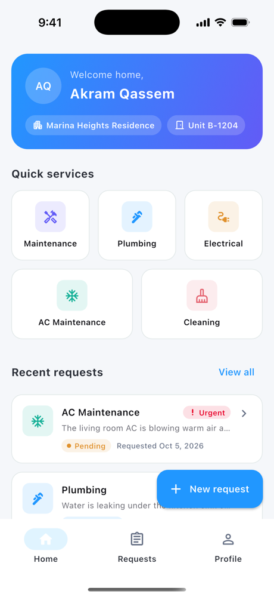
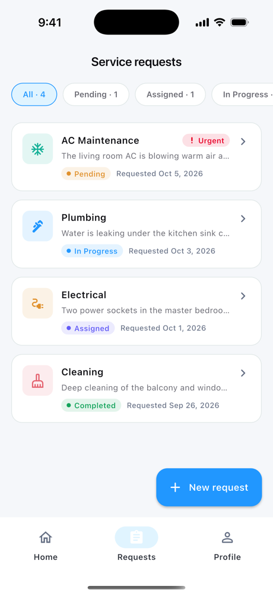
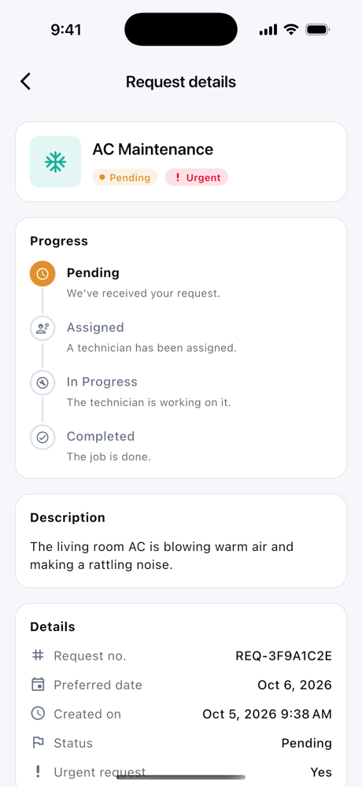
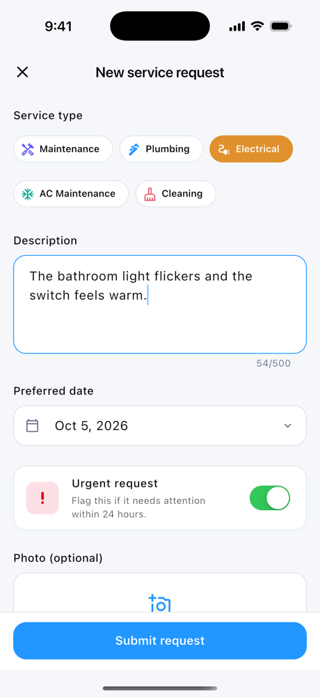
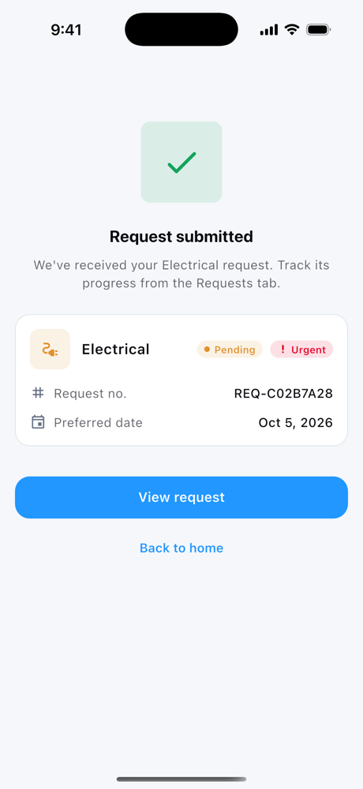
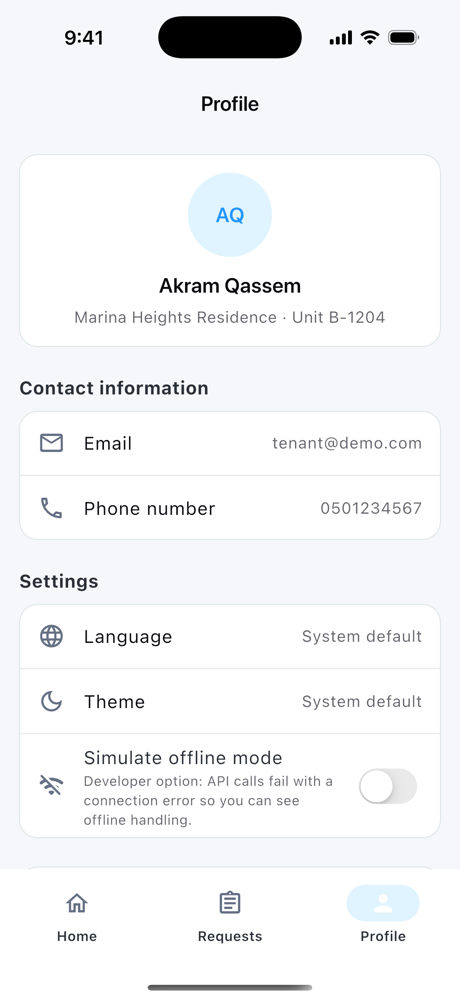
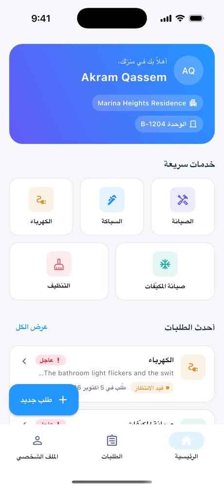
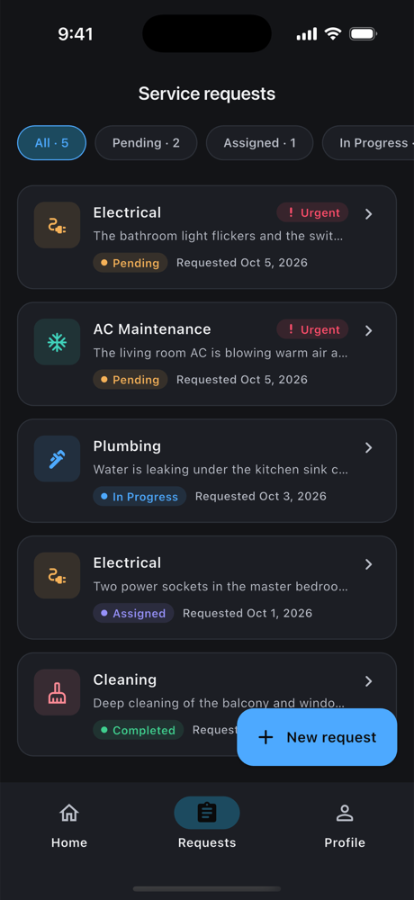

# Tenant Hub — Flutter Tenant App

A small tenant application built for the Flutter take-home assignment. Tenants can sign in, see their property and unit, open service requests (maintenance, plumbing, electrical, AC, cleaning) with an optional photo, and track each request through **Pending → Assigned → In Progress → Completed**.

The project follows **Clean Architecture** with **Riverpod** for state management. The folder structure, naming, widgets, theming, localization and error-handling conventions mirror a production codebase I work on (Ulearna), with Riverpod taking the place of Bloc + GetIt.

## Screenshots

Captured on an iPhone 16 Pro simulator (`dev` flavor). All files are in [`docs/screenshots/`](docs/screenshots/).

| Sign in | Home | Requests |
|---|---|---|
|  |  |  |
| **Request details** | **New request** | **Submitted** |
|  |  |  |
| **Profile** | **Arabic (RTL)** | **Dark mode** |
|  |  |  |

---

## Quick start

**Requirements:** Flutter **3.29+**, Android Studio with the **Flutter** plugin, and an Android emulator or device. Xcode is needed for iOS.

1. Unzip / clone the project.
2. In Android Studio, choose **File → Open** and select the `tenant_app` folder (the one containing `pubspec.yaml`).
3. Edit the `main.dart` run configuration and set **Build flavor** to `dev` (or `stg` / `prod`).
4. Pick an emulator or device and press **▶ Run**. Android Studio runs `pub get` automatically.

From the command line, pass a flavor (required, on both Android and iOS):

```bash
flutter run --flavor dev
flutter run --flavor stg
flutter run --flavor prod
```

In Xcode, open `ios/Runner.xcworkspace` and pick the `dev` / `stg` / `prod` scheme.

### Flavors

| Flavor | App name | Android applicationId | iOS bundle id |
|---|---|---|---|
| `dev` | Tenant Hub Dev | `com.tenantapp.tenant_app.dev` | `com.tenantapp.tenantApp.dev` |
| `stg` | Tenant Hub Stg | `com.tenantapp.tenant_app.stg` | `com.tenantapp.tenantApp.stg` |
| `prod` | Tenant Hub | `com.tenantapp.tenant_app` | `com.tenantapp.tenantApp` |

Configured in the `flavorizr:` block of `pubspec.yaml`. At runtime `FlavorSettings` (`core/data/utils/flavor_settings.dart`) reads `appFlavor`, and `configurationProvider` exposes the flavor's `Configuration` (base URL etc.).

### Scripts

```bash
./scripts/project_setup.sh          # pub get + flutter_flavorizr
./scripts/clean_up.sh               # flutter clean + pub get + generate.sh
./scripts/generate.sh               # build_runner: freezed, json_serializable, retrofit, reactive_forms_generator
./scripts/generate_localizations.sh # intl_utils: lib/l10n/*.arb -> lib/generated
./scripts/firebase_setup.sh         # flutterfire per flavor (fill the TODO project names first)
```

None of these are needed to run the app: generated files (`*.freezed.dart`, `*.g.dart`, `*.gform.dart`) are committed. Run `./scripts/generate.sh` after changing a model, API client or form input. The `android/` and `ios/` projects are included and already configured:
- **iOS:** camera/photo permissions and Arabic localization
- **Android:** `INTERNET` permission and `minSdk 24`

**Demo account** (also shown on the sign-in screen with a one-tap "Use demo account"):

| Email | Phone | Password |
|---|---|---|
| `tenant@demo.com` | `0501234567` (or `+971 50 123 4567`) | `Tenant@123` |

### Tests

```bash
flutter test
```

---

## Features

| Requirement | Implementation |
|---|---|
| **Login** (email or phone + password, validation, mocked auth) | Reactive form with `RequiredValidator`, custom `EmailOrPhoneValidator` and min-length. The mock API accepts the demo account by email or phone (local or international format). The token is kept in Keychain/Keystore (`flutter_secure_storage`) and the profile in shared preferences, so the session survives restarts. |
| **Tenant Home** | Greeting card (name, property, unit), quick-access grid for the 5 service types (each pre-selects the type on the form), and recent requests (latest 3, "View all" switches to the Requests tab). |
| **Create Service Request** | Service type chips, description (10–500 chars), preferred date (native iOS wheel / Material calendar, today → +90 days), urgent switch, optional photo (camera or gallery). On success a confirmation screen shows the request number (with haptic feedback), and the request is already at the top of the Requests tab underneath it. |
| **Service Requests list** | Type, request date, status label, urgent badge, description preview; status filter chips with counts (reset after a new submission so it's never hidden); pull-to-refresh; tap → details. |
| **Request Details** | Request number, type, description, preferred date, status, created date, urgent flag, attached photo (tap for zoomable full screen) and a vertical progress timeline. |
| **Loading / empty / error states** | Shimmer skeletons and adaptive spinners; empty states with call-to-action; a shared `ErrorView` with retry; snackbars for action errors via the `ScreenUtils` mixin; blocking `ScreenLoader` during submits. |

### Bonus points covered

- **Offline handling + local caching.** Request lists are cached in **Hive**. Lists load cache first, then network. When offline, cached data stays on screen with a banner, and details fall back to the cached copy. The connectivity check uses `internet_connection_checker_plus`. In debug builds, *Profile → Developer options → Simulate offline mode* forces every API call to fail, so this can be demoed.
- **Platform-aware UI.**
  - Adaptive page transitions (Cupertino swipe-back on iOS)
  - Adaptive date picker, dialogs, switches, spinners and pull-to-refresh
- **Responsive layout.**
  - Bottom navigation on phones, navigation rail on tablets and landscape
  - Content width capped on large screens; the quick-services grid adapts its columns
  - `.spMin` typography keeps text from ballooning on tablets
  - Text scale is clamped at 1.3×
- **Localization: English and Arabic, with full RTL support.**
  - Directional paddings, alignment and icons
  - Language and theme (light/dark/system) can be switched in Profile and are persisted
- **Unit and widget tests** (56).
  - Validators and the request reference number
  - Auth (session restore, logout incl. failure), sign-in, list, create and details notifiers (including cache/offline paths and concurrent refreshes)
  - Repository (`DioException` → failure mapping, attachment flow and cleanup)
  - The network stack end to end: Retrofit clients → Dio → mock backend (sign-in, 422, list, create → details, 404, offline)
  - Sign-in screen, request card, status filter, Home recent requests (list/empty/error) and the confirmation screen
- **Reusable components:** see `lib/core/presentation/widgets/`.
- **Git history:** small, scoped commits.

---

## Architecture

```text
lib/
├── main.dart                   # bootstrap: configureInjection() → ProviderScope(overrides)
├── injection.dart              # pre-resolved async deps (SharedPreferences, Hive box, docs dir)
├── injectable_module.dart      # third-party providers (secure storage, image picker, logger, …)
├── src/app.dart                # ScreenUtilInit, MaterialApp.router, theme, l10n, ReactiveFormConfig, auth listener
├── core/
│   ├── data/                   # BaseRepositoryImpl, exceptions, constants, NetworkInfo, BaseResponse, Dio mock backend, LanguageEnum
│   ├── domain/                 # Failure types, ServerErrorCode, BaseRepository, NetworkInfo interface
│   ├── presentation/
│   │   ├── providers/          # app-wide state: auth session, app settings (language/theme)
│   │   ├── routes/             # go_router config (auth redirect, tab shell, full-screen pages)
│   │   └── widgets/            # Base* buttons, fields, date picker, sheets, dialogs, ErrorView, spacers, mixins…
│   ├── l10n/                   # AppLocalizations + EN/AR translation maps
│   ├── theme/                  # AppColors (ColorScheme), AppStyles (TextTheme), AppDimens, AppRadius, AppTheme
│   └── utils/                  # BuildContext/num/DateTime extensions, form validators, media picker
└── features/
    ├── auth/                   # data (local/remote sources, models, repo impl) · domain · presentation
    ├── service_requests/       # data (Hive cache + mock API) · domain · presentation (3 notifiers, 3 screens)
    ├── home/                   # dashboard tab shell + home tab
    └── profile/                # profile, settings, logout
```

Each feature is split into **data → domain → presentation**.

- **Domain:** the abstract `XRepository`.
- **Data:** `XRemoteDataSource` / `XLocalDataSource` interfaces with `Impl`s, and `XRepositoryImpl extends BaseRepositoryImpl`. Repositories only describe the happy path inside `request()` / `localRequest()`. All try/catch logic and the mapping from exception to `Failure` is centralized there, so every repository returns `Either<Failure, T>` (`dartz`).
- **Presentation:** each Riverpod `Notifier` folds that `Either` into one of its explicit states, `Initial` / `Loading` / `Successful` / `Failure` (a `sealed` class in a `part` file). Screens switch over that state exhaustively.

### Bloc + GetIt → Riverpod mapping

| Bloc / GetIt convention | This project |
|---|---|
| `presentation/blocs/x/x_bloc.dart` + `x_event.dart` + `x_state.dart` | `presentation/providers/x/x_notifier.dart` + `x_state.dart` (`part of`); events become methods |
| `@injectable` screen-scoped bloc | `NotifierProvider.autoDispose` |
| `@factoryParam` + instance-name caching | `NotifierProvider.autoDispose.family` (one instance per id, auto-disposed) |
| `@Singleton()` `AuthBloc` | `authProvider` (`core/presentation/providers/auth`) |
| `@LazySingleton(as: XRepository)` | `xRepositoryProvider` declared in `domain/`, bound to `XRepositoryImpl` via an override in `main()` |
| `@module` / `@preResolve` | `injectable_module.dart` providers / `configureInjection()` + `ProviderScope.overrides` |
| `BlocListener` / `BlocBuilder(bloc: getIt<…>())` | `ref.listen` / `ref.watch` |
| `MultiBlocProvider(lazy: false)` | shared `NotifierProvider` + an eager fetch in the dashboard |
| auto_route + `AuthGuard` + nested tab routes | go_router `redirect` + `StatefulShellRoute.indexedStack` |
| freezed / json_serializable models | same: `@freezed` models, `field_rename: snake` in `build.yaml` |
| Retrofit `@RestApi` + Dio, `BaseResponse<T>` | same: `XRemoteDataSourceImpl` Retrofit clients returning `BaseResponse<T>` |
| reactive_forms_generator `*.gform.dart` | same: `@freezed @ReactiveFormAnnotation()` inputs and the generated `XInputFormBuilder` |
| intl_utils ARB → generated `AppLocalizations` | `core/l10n/app_localizations.dart` + `translations/intl_en.dart` / `intl_ar.dart` |

Riverpod also replaces GetIt as the DI container, so tests just override providers (`ProviderContainer(overrides: […])`) with Mocktail mocks.

### Mock backend

There is no real API, but the app runs the real network stack: Retrofit clients → Dio → `MockBackendInterceptor`. The interceptor adds latency, fails like a dropped connection when offline (`DioExceptionType.connectionError`), round-trips bodies through JSON like a real wire, and routes each request to a per-feature mock server that answers with HTTP status codes and the `BaseResponse` envelope:

| Route | Mock server |
|---|---|
| `POST /auth/sign-in` | `AuthMockServer` (demo account; `422` on bad credentials) |
| `GET /service-requests`, `GET /service-requests/{id}`, `POST /service-requests` | `ServiceRequestsMockServer` (`404` for unknown ids) |

The service-requests mock server persists its "database" in shared preferences and seeds a few realistic requests on first launch. `BaseRepositoryImpl` maps `DioException` to `ServerFailure` by status code, as in the reference codebase. Switching to a real backend means removing the interceptor from `dioProvider`; requests then go to `Configuration.getBaseUrl` for the flavor.

### Key packages

`flutter_riverpod`, `go_router`, `dio`, `retrofit`, `freezed`, `json_serializable`, `reactive_forms` + `reactive_forms_generator`, `dartz`, `equatable`, `hive`, `shared_preferences`, `flutter_secure_storage`, `image_picker`, `internet_connection_checker_plus`, `flutter_screenutil`, `shimmer`, `mocktail`.

**Code generation.** Models, API clients and form inputs use the same generators as the reference codebase. Generated files are committed so the project opens and runs with no setup step. Generator versions are pinned to a set that compiles together (analyzer 7, as in the reference codebase); see the comments in `pubspec.yaml`. Translations stay hand-written (`core/l10n`).

---

## Notes and trade-offs

- **Photos** are copied from the picker's temp folder into the app documents folder. Only the **file name** is persisted, and the absolute path is resolved at read time, because iOS changes the app container path between installs and updates.
- **Status progression** is server-driven. With the mock API, new requests stay *Pending*; the seeded requests demonstrate the other states and the timeline.
- **Models double as entities.** As in the reference codebase, the (freezed, immutable) data models are used across layers instead of separate domain entities, so domain and presentation import `data/models`. This keeps a small app free of mapping boilerplate. Repository *implementations* stay behind the domain: each `xRepositoryProvider` is declared in `domain/` and bound to its `XRepositoryImpl` in `main()` (`repositoryOverrides` in `injection.dart`), so notifiers never import the data layer's repositories.
- **Not included (out of scope):** Firebase/Crashlytics (only the setup script), push notifications, and CI.

---

## AI-assisted development

- **Tools used:** [Claude Code](https://claude.com/claude-code) (Anthropic). Commits it helped with carry a `Co-Authored-By: Claude` trailer.
- **What it was used for:**
  - Translating my production house style (Ulearna: Clean Architecture, Bloc + GetIt, auto_route, freezed) into the Riverpod + go_router equivalents (see the mapping table above)
  - Boilerplate: freezed models, Retrofit data sources, the Dio mock-backend interceptor, generated form inputs, sealed notifier states
  - The Arabic translations and the unit and widget tests
  - Build flavors and setup scripts mirroring the reference project
  - A requirements audit against the assignment brief, the bug fixes that came out of it, and drafting this README
- **What I reviewed / changed manually:**
  - <!-- TODO(Akram): e.g. architecture decisions, UI/UX choices, screens you reworked, bugs you found on device -->
  - <!-- TODO(Akram): how you verified it (devices/simulators used, flows tested by hand) -->
  - Every generated change was reviewed before committing. I can explain or modify any part of it.
